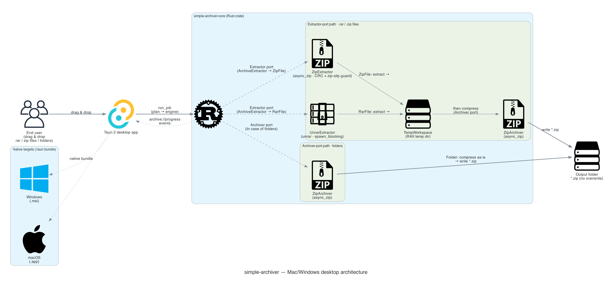
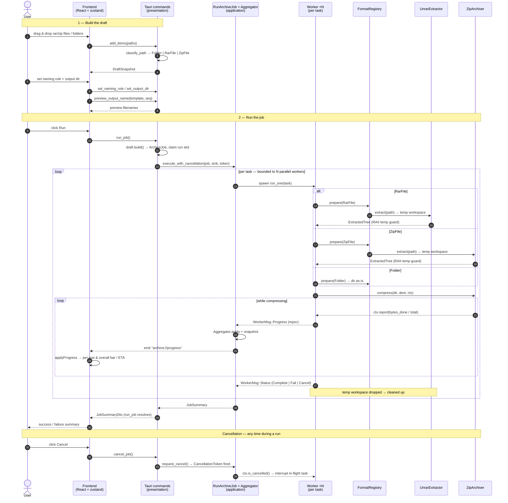

# simple-archiver

[](https://github.com/yasuflatland-lf/simple-archiver/actions/workflows/ci.yml)
[](https://codecov.io/gh/yasuflatland-lf/simple-archiver)
[](https://codecov.io/gh/yasuflatland-lf/simple-archiver)

A native desktop app (Mac / Windows) that takes drag-and-dropped **rar files**, **zip files**, and **folders** and batch re-archives them into **zip** files following a single naming rule. rar and zip files are extracted and re-compressed to standard Deflate zip; folders are zipped as-is.

## Architecture



## Overview

Drop a mix of rar files, zip files, and folders, reorder them, give the batch a single naming rule with an auto-incrementing sequence number, and hit run. Each item is compressed to a zip in list order, with a per-row progress bar and ETA plus an overall progress bar and ETA for the whole job.

It ships as a single self-contained native application built with **Tauri 2** — a Rust engine for the archiving work and a Vite + React frontend for the UI.

## Features

- **Drag & drop intake** — add multiple rar files, zip files, and/or folders at once (drag-drop or a file dialog).
- **Reorderable list** — move items up and down; the run order follows the list top to bottom.
- **Batch naming rule** — specify a single prefix string and number every item sequentially from `1`, top to bottom. A placeholder inside the prefix marks where the sequence number goes: `{n}` inserts the bare number, and `{n:0W}` zero-pads it to width `W` (1–9), e.g. `photo_{n:03}` → `photo_001`, `photo_002`, … A **live preview** shows the resulting `seq=1` filename as you type, and every queue row previews its own output name. The sequence number is fixed at job-creation time in list order (independent of completion order). Output names are de-duplicated case-insensitively and validated to be Windows-safe.
- **One-click run** — compresses every item per the naming rule, from the top of the list:
  - **rar file** → extracted to a temporary workspace, then re-compressed into a standard Deflate zip.
  - **zip file** → extracted to a temporary workspace, then re-compressed into a standard Deflate zip.
  - **folder** → compressed into a zip directly.
- **Live per-item progress** — each row shows a progress bar and an estimated-time-remaining string, updated asynchronously while the job runs.
- **Overall progress** — a job-wide progress bar and ETA for all items combined.
- **Output directory** — pick one destination folder through the native OS picker; all archives are written there. The app remembers your last chosen directory and, on first run, defaults to the OS Downloads folder.
- **Resilient by design** — existing names are **not overwritten** (that item fails instead), a failed item never stops the others, and a run can be cancelled (in-flight work is interrupted and partial output / temp files are cleaned up). A run summary tallying **succeeded / cancelled / failed** items is shown at the end.

## Getting started

Prerequisites: a Rust toolchain, Node.js, and pnpm. The toolchain versions are pinned via [`mise.toml`](mise.toml) (run `mise install` to get them), and the Tauri prerequisites for your OS are listed in the [Tauri docs](https://v2.tauri.app/start/prerequisites/).

```bash
pnpm install          # install frontend dependencies
pnpm tauri dev        # run the app in development
pnpm tauri build      # build a native bundle for the current OS
```

## Development

Run all commands from the repo root (the Cargo workspace lives there, not under `src-tauri/`).

```bash
# Rust — pure core (the TDD battleground; -p keeps Tauri out)
cargo nextest run -p simple-archiver-core
cargo clippy -p simple-archiver-core --all-targets -- -D warnings
cargo fmt

# Frontend
pnpm test             # Vitest one-shot
pnpm check            # oxfmt + oxlint: format + lint with autofix
pnpm build            # tsc + vite build (the load-bearing type gate)
```

## Tech stack

| Area | Choice |
|---|---|
| Framework | [Tauri 2](https://v2.tauri.app/) — single native app for Mac / Windows |
| Frontend | [Vite](https://vite.dev/) + [React 19](https://react.dev/) + TypeScript (strict) + [Tailwind CSS v4](https://tailwindcss.com/) + [shadcn/ui](https://ui.shadcn.com/) (new-york) on [Radix](https://www.radix-ui.com/) primitives ([class-variance-authority](https://cva.style/) + [clsx](https://github.com/lukeed/clsx) + [tailwind-merge](https://github.com/dcastil/tailwind-merge)) + [lucide-react](https://lucide.dev/) (icons) + [zustand](https://zustand-demo.pmnd.rs/) (state) + [Inter](https://github.com/fontsource/fontsource) (variable font) |
| Design | Base layout after [shadcn-admin](https://shadcn-admin.netlify.app/); design system after the [shadcn.io ASICS design](https://www.shadcn.io/design/asics) (ASICS color tokens, light/dark theme, Inter typography) |
| Backend / engine | Rust, DDD layered / hexagonal (Cargo workspace: pure `simple-archiver-core` crate + `src-tauri` presentation crate) |
| zip creation | [`async_zip`](https://crates.io/crates/async_zip) |
| rar extraction | [`unrar`](https://crates.io/crates/unrar) (extract-only; bundled C++ source for both Mac / Windows) |
| Pluggable compression | `Extractor` / `Archiver` / `Clock` ports + a `FormatRegistry` that routes each source kind to the right adapter — see [Pluggable compression](#pluggable-compression) |
| TypeScript bindings | [`ts-rs`](https://crates.io/crates/ts-rs) (`#[derive(TS)]` on DTOs generates the `.ts` wire contract in `src/bindings/`) |
| Naming parser | [LALRPOP](https://crates.io/crates/lalrpop) (grammar codegen) + [logos](https://crates.io/crates/logos) (lexer) — build-time tooling inside `simple-archiver-core` |
| Rust tests | [cargo-nextest](https://nexte.st/) (runner) + [mockall](https://crates.io/crates/mockall) (port mocks) + [loom](https://crates.io/crates/loom) (concurrency verification) |
| Frontend tests | [Vitest](https://vitest.dev/) + Testing Library (jsdom) |
| Format / lint | [oxlint](https://oxc.rs/docs/guide/usage/linter) + [oxfmt](https://oxc.rs/docs/guide/usage/formatter) (frontend) + `cargo fmt` / `clippy` (Rust) |
| Dead-code | [knip](https://knip.dev/) (frontend, `pnpm knip`) |
| Tooling | [pnpm](https://pnpm.io/) (package manager) + [mise](https://mise.jdx.dev/) (pinned toolchain) |

Technology choices are fixed. The compression libraries are deliberately kept behind a common interface so they can be treated as plugins (see below), but the libraries themselves are not swapped without a corresponding design change.

### Pluggable compression

The spec calls for the compression libraries to be treated as plugins, behind a common interface, with the per-format differences isolated in one place. This is realized with:

- **Common ports** — `Extractor` (rar → directory) and `Archiver` (directory → zip), so the engine drives any format through the same async interface.
- **`FormatRegistry`** — resolves each `SourceItem` to a compressible directory: a `Folder` is compressed directly, while a `RarFile` or `ZipFile` is first extracted (via `UnrarExtractor` or `ZipExtractor` respectively) into a `TempWorkspace` RAII guard and then re-compressed to standard Deflate zip. The guard's `Drop` guarantees temp cleanup even on error.

Adding another archive format means adding an adapter behind these ports and a branch in the registry — the engine, domain, and UI stay untouched.

## Processing flow

The end-to-end path from a drop to the final summary, across the four layers:



Workers run concurrently up to `available_parallelism`, but only one task — the aggregator on the engine's own task — ever writes progress: each worker pushes `WorkerMsg` over an `mpsc` channel, the aggregator folds them into a job-wide snapshot, and the presentation layer's `TauriEmitter` forwards each snapshot to the frontend as an `archive://progress` event. A failed item is tallied but never stops its siblings, and `run_job` always resolves with a `JobSummaryDto` — the load-bearing terminal signal — even if some progress frames were dropped along the way.


## Documentation

- [`docs/architecture.md`](docs/architecture.md) — layered / hexagonal design and layer boundaries
- [`docs/development.md`](docs/development.md) — tech stack, dev commands, testing policy, PR rules
- [`CLAUDE.md`](CLAUDE.md) — mandatory project rules and documentation map

## License

This project is licensed under the [MIT License](LICENSE).
